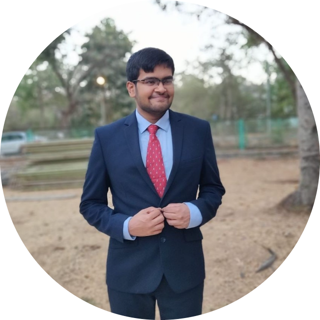

I'm a PhD candidate in <a href="https://www.ese.upenn.edu/">Electrical and Systems Enginnering</a> at the University of Pennsylvania, where I'm advised by <a href="https://www.cis.upenn.edu/~lee/home/index.shtml">Insup Lee</a>, <a href="https://www.seas.upenn.edu/~weimerj/research.html">James Weimer</a> and <a href="https://www.cis.upenn.edu/~sokolsky/">Oleg Sokolsky</a>. 

My research interests span reinforcement learning (RL), learning for dynamics and control (L4DC), and robust deep learning with applications in cloud-computing, robotics, and cyber-physical systems.

Before starting my PhD, I graduated with honors from the <a href="https://www.iitb.ac.in/">Indian Institute of Technology Bombay</a> and did an undergraduate internship at Duke University. 

*Research Internships*
* May-Aug 2022 - <a href="https://aws.amazon.com/machine-learning/ai-services/">Amazon Web Services (AWS) AI Labs</a>
* May-Aug 2021 - <a href="https://www.argo.ai/">Argo AI</a> (Ford and VW's self-driving partner)

*Awards*
* <a href="https://nips.cc/Conferences/2022/ProgramCommittee#%23:~:text=Katsuhiko%20Ishiguro-,Kaustubh%20Sridhar,Ke%20Sun,-Keane%20Lucas">Top reviewer</a>, NeurIPS 2022
* <a href="https://icml.cc/Conferences/2022/Reviewers#%23:~:text=Kartik%20Sreenivasan-,kaustubh%20sridhar,-Ke%20Sun">Outstanding reviewer</a> (top 10%), ICML 2022
* The Dean's Fellowship and Howard Broadwell Fellowship, University of Pennsylvania 
* SN Bose Scholarship and KVPY Fellowship, Gov. of India

My research (and publications) are listed below.

Email: <a target="_blank" title="Email" href="mailto:ksridhar@seas.upenn.edu">ksridhar@seas.upenn.edu</a>. 
    
<!--  -->
